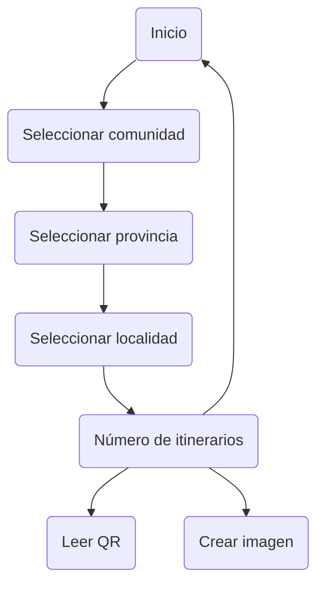

### Bienveneido a mi repositorio personal
En el puede encontrar algunas cosas seria y no tan serias, pero sobre todo ganas se continuar para adquirir competencias en el desarrollo personal y profesional.
| Nivel | Lenguaje |
|-----:|-----------|
|     1| PHP|
|     2| Java    |
|     3| SQL       |
|4| JavaScript|

<!--
**juancmacias/juancmacias** is a ✨ _special_ ✨ repository because its `README.md` (this file) appears on your GitHub profile.

Here are some ideas to get you started:

- 🔭 I’m currently working on ...
- 🌱 I’m currently learning ...
- 👯 I’m looking to collaborate on ...
- 🤔 I’m looking for help with ...
- 💬 Ask me about ...
- 📫 How to reach me: ...
- 😄 Pronouns: ...
- ⚡ Fun fact: ...
-->
